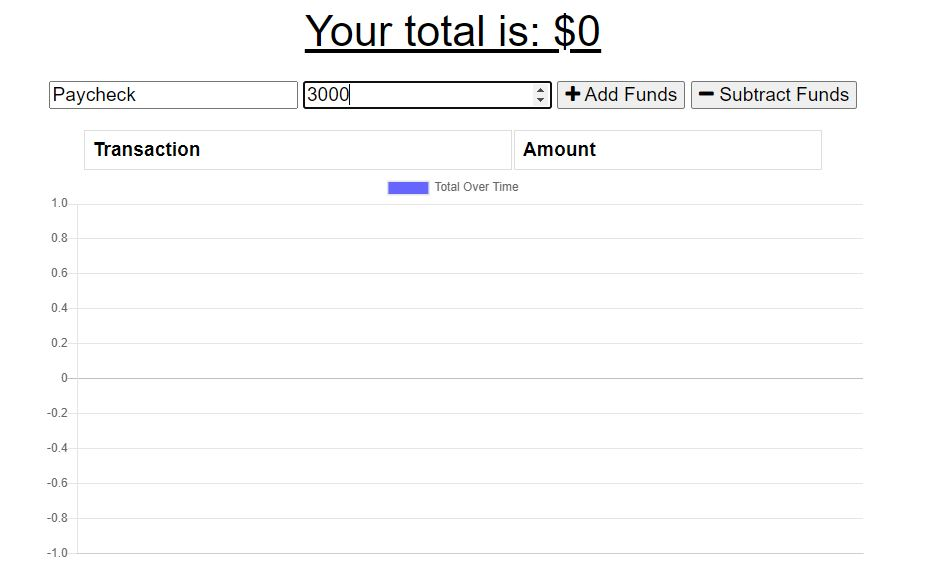
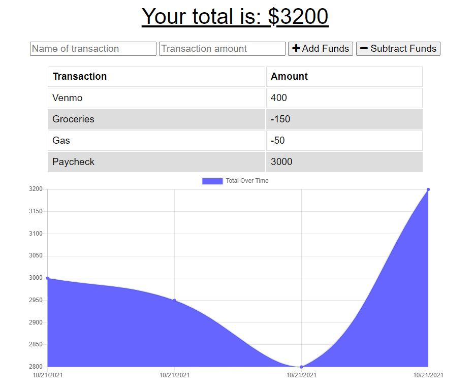

# Budget_Tracker

## Description

This project is a Budget Tracker that is able to function offline, and any offline changes are persistent when online connection is reestablished. Users can input expenses and deposits with a title to match those entries. These will be reflected in a graph displaying the balance changes, and there is a total funds display above. This app utilizes IndexedDB, a manifest.json, and a service-worker to accomplish offline functionality and persistence while transitioning to online.

## Table of Contents

1. [Description](#description)
2. [Installation](#installation)
3. [Usage](#usage)
4. [License](#license)

## Installation

First you will need to fork, then clone, the repository to your local, and make sure you're ready to use Node.js, Mongo, and Mongoose. After doing so, open the integrated terminal in the Workout_Tracker directory and in the command line enter "npm i" or "npm install" to install the necessary dependancies. Now you can enter "npm start" to start the app. These commands and their terminal responses are shown below.  

## Usage

You can access the app by installing and starting it, then navigating to the localhost port. You can also access the live app [here](https://calm-beach-82251.herokuapp.com/). Upon navigating to the app you will see a home page that looks like the following image.

  

Now you can enter a transaction name and amount, and choose to add or subtract the entered value. The next image shows usage of the input fields, following that is the results of several entries.

  

  

To test the offline functionality, you can simply open the developer tools and either turn throttling to "offline" in the Network tab, or check the "offline" box for the Service Worker in the Application tab. An offline entry is shown below. The Network tab shows the warning for offline mode and you can see the Rent entry stored in the IndexedDB, which will get passed to the back-end when connection is reestablished.

  

Upon going back online and refreshing the page, all the entries will still be present.

You can check out the deployed app [here](https://calm-beach-82251.herokuapp.com/).

## License

The license under which this project is covered is the MIT License. Learn more about that license [here](https://choosealicense.com/licenses/mit/).
